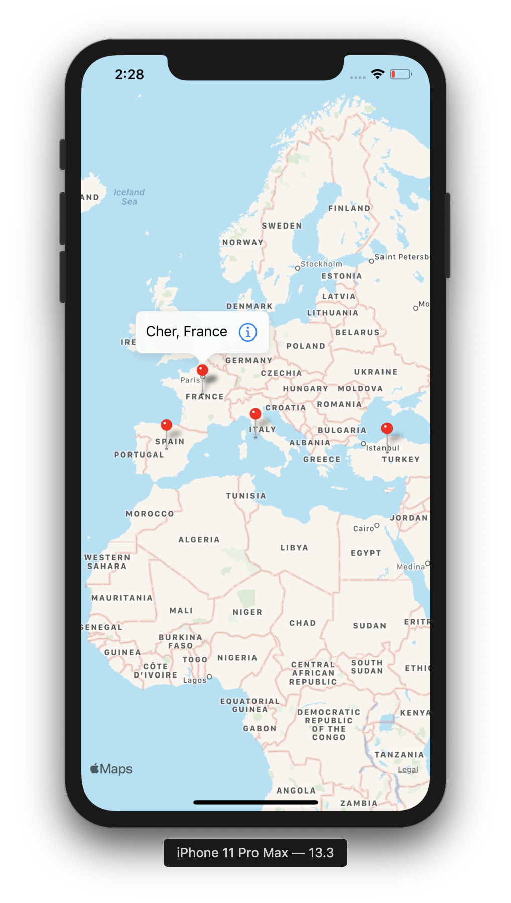

# Virtual Tourist (iOS Nanodegree)

The Virtual Tourist app utilizes Flickr API and Apple MapKit to let users download and store images from Flickr. The app allows users to drop pins on a map, as if they were stops on a tour. Users will then be able to download pictures for the location and persist both the pictures, and the association of the pictures with the pin. The photos are then displayed in a collection view.

The Data Model was implemented using Apple CoreData to persist the downloaded images in the app rather than downloading them each time the user launches the app. The user has the ability to fetch a new collection of images by pressing the New Collection Button which deletes the existing images and fetches new ones.

The App consists of two view controllers:

- Map View Controller:

  

- Photo Album View Controller:

  

##Dependencies:
- Apple UIKit
- Apple CoreData
- Apple MapKit
- FlickrAPI
